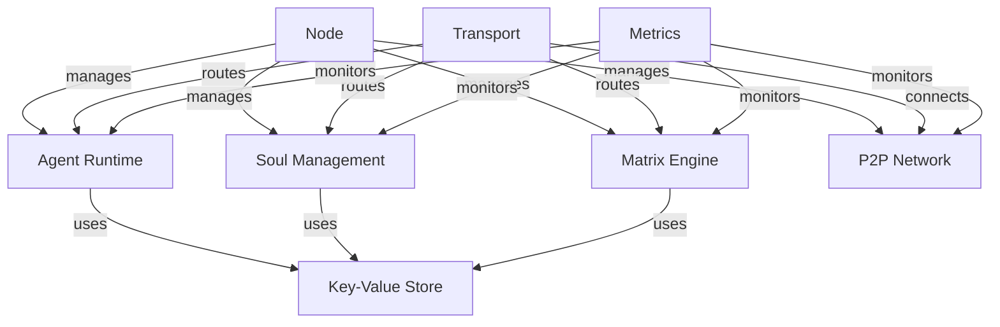

# Matrix Core

Matrix Core is the foundational runtime for the Matrix ecosystem, enabling peer-to-peer Soul interactions and Matrix simulations. Written in Go, it provides a distributed runtime environment that can transform any computer into a Matrix node, capable of hosting Souls, executing Matrices, and participating in decentralized message exchange.

## 🏗 Architecture

Matrix Core follows a modular architecture with clear separation of concerns:

### Core Components

| Component | Package | Description |
|-----------|---------|-------------|
| Node Lifecycle | `internal/node` | Configuration, startup, shutdown, and component orchestration |
| Agent Runtime | `internal/agent` | WebAssembly execution environment with resource controls |
| Soul Management | `internal/soul` | Soul state, memory, and lifecycle management |
| Matrix Engine | `internal/matrix` | Simulation environment with rules and event processing |
| P2P Networking | `internal/p2p` | Peer discovery and networking via libp2p |
| Message Transport | `internal/transport` | Message routing and event distribution |
| Key-Value Store | `internal/kv` | Persistent storage using Pebble |
| Metrics | `internal/metrics` | Prometheus metrics collection |

### Directory Structure

```
matrix-core/
├── cmd/
│   └── matrixd/           # Main daemon executable
├── internal/
│   ├── agent/            # WebAssembly runtime and host functions
│   ├── soul/             # Soul state and lifecycle management
│   ├── matrix/           # Simulation engine and rule processing
│   ├── p2p/              # libp2p networking and peer discovery
│   ├── transport/        # Message routing and event distribution
│   ├── kv/              # Key-value storage with Pebble
│   ├── metrics/         # Prometheus metrics collection
│   └── node/            # Node lifecycle and configuration
├── .github/             # GitHub Actions and configs
└── configs/             # Configuration templates
```

### Component Interactions



### Key Features

1. **Node Management** (`internal/node`)
   - Configuration management
   - Component lifecycle
   - Graceful shutdown
   - Resource coordination

2. **Agent Runtime** (`internal/agent`)
   - WebAssembly execution
   - Resource limits
   - Host functions
   - Memory management

3. **Soul Management** (`internal/soul`)
   - Soul state persistence
   - Memory management
   - Lifecycle control
   - Training coordination

4. **Matrix Engine** (`internal/matrix`)
   - Rule processing
   - Event handling
   - Agent coordination
   - State management

5. **P2P Network** (`internal/p2p`)
   - Peer discovery
   - Connection management
   - Stream handling
   - NAT traversal

6. **Message Transport** (`internal/transport`)
   - Message routing
   - Event distribution
   - Pub/sub handling
   - Protocol management

7. **Storage** (`internal/kv`)
   - Persistent storage
   - State management
   - Data replication
   - Transaction handling

8. **Metrics** (`internal/metrics`)
   - Performance monitoring
   - Resource tracking
   - Event counting
   - Health checks

## 🔧 Configuration

Matrix Core uses YAML configuration for node settings:

```yaml
network:
  listen_addr: "0.0.0.0:9000"
  bootstrap_peers:
    - "/ip4/1.2.3.4/tcp/9000/p2p/QmExample..."

storage:
  engine: "pebble"
  path: "/var/lib/matrix/data"

security:
  enable_acls: true
  allow_unsigned_agents: false
```

## 🚀 Getting Started

1. Build the daemon:
   ```bash
   go build ./cmd/matrixd
   ```

2. Initialize a new node:
   ```bash
   ./matrixd --init
   ```

3. Start the node:
   ```bash
   ./matrixd
   ```

## 📈 Monitoring

Matrix Core exposes metrics via Prometheus:

- Soul metrics (memory, state)
- Matrix metrics (events, rules)
- Agent metrics (resources, execution)
- P2P metrics (peers, bandwidth)
- System metrics (CPU, memory)

## 📄 License

MIT License - See [LICENSE](LICENSE) for details.